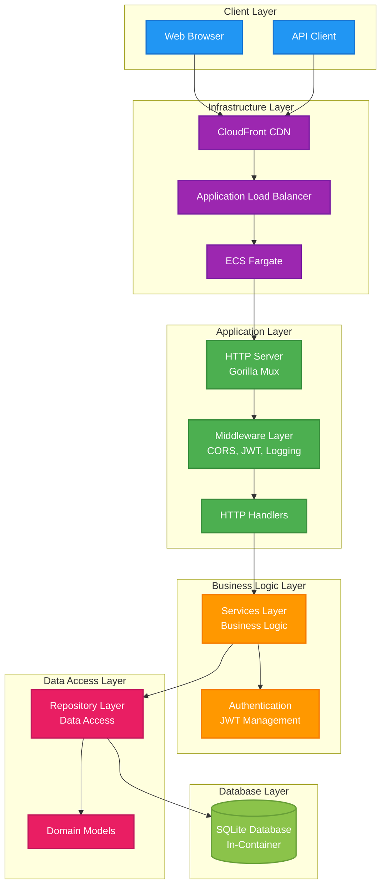
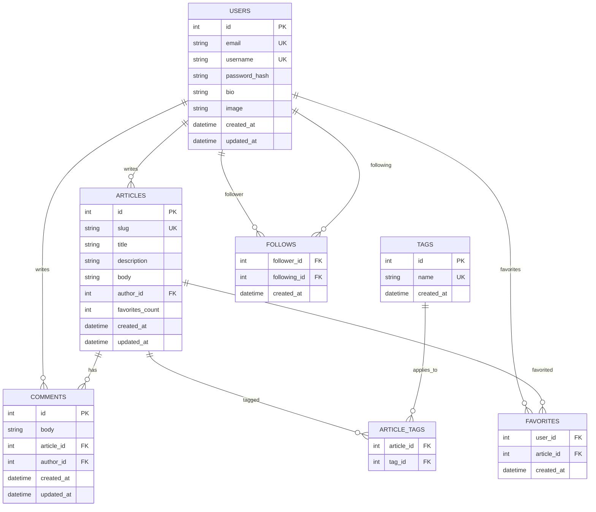

# RealWorld Backend (Go)

[](https://github.com/Hands-On-Vibe-Coding/realworld-vibe-coding/actions/workflows/backend-deploy.yml)

A robust, production-ready backend implementation of the [RealWorld specification](https://realworld-docs.netlify.app/docs/specs/backend-specs) built with Go, following clean architecture principles and optimized for educational use.

## 🏗️ Architecture Overview



## 📁 Project Structure

```
backend/
├── cmd/
│   └── server/
│       └── main.go              # Application entry point
├── internal/
│   ├── config/
│   │   └── config.go            # Configuration management
│   ├── db/
│   │   ├── database.go          # Database connection setup
│   │   ├── drivers_sqlite.go    # SQLite driver configuration
│   │   └── migrations.go        # Database migrations
│   ├── handler/                 # HTTP request handlers
│   │   ├── article.go           # Article CRUD operations
│   │   ├── auth.go              # Authentication endpoints
│   │   ├── comment.go           # Comment management
│   │   ├── health.go            # Health check endpoints
│   │   ├── profile.go           # User profile operations
│   │   ├── tag.go               # Tag management
│   │   └── user.go              # User management
│   ├── middleware/              # HTTP middleware
│   │   ├── cors.go              # CORS configuration
│   │   ├── jwt.go               # JWT authentication
│   │   └── logging.go           # Request logging
│   ├── model/                   # Domain models
│   │   ├── article.go           # Article data structures
│   │   ├── comment.go           # Comment data structures
│   │   └── user.go              # User data structures
│   ├── repository/              # Data access layer
│   │   ├── article.go           # Article database operations
│   │   ├── comment.go           # Comment database operations
│   │   ├── tag.go               # Tag database operations
│   │   └── user.go              # User database operations
│   ├── service/                 # Business logic layer
│   │   ├── article.go           # Article business logic
│   │   ├── comment.go           # Comment business logic
│   │   ├── profile.go           # Profile business logic
│   │   ├── tag.go               # Tag business logic
│   │   └── user.go              # User business logic
│   └── utils/                   # Utility functions
│       ├── jwt.go               # JWT utilities
│       ├── password.go          # Password hashing
│       ├── slug.go              # URL slug generation
│       └── tags.go              # Tag processing
├── migrations/                  # SQL migration files
├── Dockerfile                   # Container configuration
├── Dockerfile.dev               # Development container
├── go.mod                       # Go module dependencies
├── go.sum                       # Dependency checksums
└── README.md                    # This file
```

## 🚀 Quick Start

### Prerequisites

- Go 1.23 or higher
- SQLite (included in container)
- Docker (for containerized deployment)

### Local Development

1. **Clone and navigate to backend directory:**
   ```bash
   git clone <repository-url>
   cd realworld-vibe-coding/backend
   ```

2. **Install dependencies:**
   ```bash
   go mod download
   ```

3. **Set environment variables:**
   ```bash
   export DATABASE_URL="./realworld.db"
   export JWT_SECRET="your-super-secret-jwt-key"
   export PORT="8080"
   ```

4. **Run the server:**
   ```bash
   go run cmd/server/main.go
   ```

5. **Verify the server is running:**
   ```bash
   curl http://localhost:8080/health
   # Expected: {"status":"ok","service":"realworld-backend"}
   ```

### Using Make Commands (Recommended)

From the project root directory:

```bash
# Start backend development server
make dev-back

# Run backend tests
make test-back

# Build backend
make build-back

# Run linting
make lint

# Format code
make format
```

## 🔧 Configuration

The application uses environment variables for configuration:

| Variable | Description | Default |
|----------|-------------|---------|
| `DATABASE_URL` | SQLite database file path | `./realworld.db` |
| `JWT_SECRET` | Secret key for JWT token signing | Required |
| `PORT` | Server port | `8080` |

## 📊 Database Schema



## 🛡️ API Endpoints

### Authentication
- `POST /api/users` - User registration
- `POST /api/users/login` - User login
- `GET /api/user` - Get current user (auth required)
- `PUT /api/user` - Update user (auth required)

### Articles
- `GET /api/articles` - List articles (with filtering)
- `GET /api/articles/feed` - Get user feed (auth required)
- `GET /api/articles/{slug}` - Get single article
- `POST /api/articles` - Create article (auth required)
- `PUT /api/articles/{slug}` - Update article (auth required)
- `DELETE /api/articles/{slug}` - Delete article (auth required)
- `POST /api/articles/{slug}/favorite` - Favorite article (auth required)
- `DELETE /api/articles/{slug}/favorite` - Unfavorite article (auth required)

### Comments
- `GET /api/articles/{slug}/comments` - Get comments for article
- `POST /api/articles/{slug}/comments` - Add comment (auth required)
- `DELETE /api/articles/{slug}/comments/{id}` - Delete comment (auth required)

### Profiles
- `GET /api/profiles/{username}` - Get user profile
- `POST /api/profiles/{username}/follow` - Follow user (auth required)
- `DELETE /api/profiles/{username}/follow` - Unfollow user (auth required)

### Tags
- `GET /api/tags` - Get all tags

### Health Check
- `GET /health` - Service health status

## 🔒 Security Features

- **JWT Authentication**: Secure token-based authentication
- **Password Hashing**: bcrypt for secure password storage
- **CORS Protection**: Configurable cross-origin requests
- **Input Validation**: Request validation and sanitization
- **SQL Injection Prevention**: Parameterized queries
- **Rate Limiting**: (Implemented at infrastructure level)

## 🧪 Testing

### Running Tests

```bash
# Run all tests
go test ./...

# Run tests with coverage
go test -cover ./...

# Run tests with verbose output
go test -v ./...

# Run specific package tests
go test ./internal/utils/
```

### Test Structure

```bash
# Current test coverage
./internal/utils/         # JWT and tag utilities
```

*Note: Test coverage expansion is planned for all layers.*

## 🐳 Docker Deployment

### Development Container

```bash
# Build development image
docker build -f Dockerfile.dev -t realworld-backend:dev .

# Run development container
docker run -p 8080:8080 -e JWT_SECRET=your-secret realworld-backend:dev
```

### Production Container

```bash
# Build production image
docker build -t realworld-backend:latest .

# Run production container
docker run -p 8080:8080 \
  -e JWT_SECRET=your-secret \
  -e DATABASE_URL=/app/data/realworld.db \
  realworld-backend:latest
```

## ☁️ AWS Deployment

The backend is deployed on AWS using:

- **ECS Fargate Spot**: Cost-efficient container hosting
- **Application Load Balancer**: Traffic distribution and health checks
- **CloudFront CDN**: Global content delivery and caching
- **VPC**: Secure network isolation

### Deployment URLs

- **Production API**: `https://d2tf8154vacbrr.cloudfront.net/api`
- **Load Balancer**: `http://realworld-alb-385549180.ap-northeast-2.elb.amazonaws.com`

### Deployment Process

1. **GitHub Actions**: Automated CI/CD pipeline
2. **ECR**: Container image registry
3. **ECS Service Update**: Rolling deployment with health checks
4. **CloudFront Invalidation**: Cache refresh for new deployments

## 🔧 Development Guidelines

### Code Style

- Follow Go standard formatting (`go fmt`)
- Use meaningful variable and function names
- Add comments for exported functions and packages
- Keep functions focused and testable

### Architecture Principles

1. **Clean Architecture**: Clear separation of concerns
2. **Dependency Injection**: Services receive dependencies
3. **Single Responsibility**: Each layer has one purpose
4. **Interface Segregation**: Small, focused interfaces
5. **Error Handling**: Explicit error returns and handling

### Adding New Features

1. **Model**: Define data structures in `internal/model/`
2. **Repository**: Add data access methods in `internal/repository/`
3. **Service**: Implement business logic in `internal/service/`
4. **Handler**: Create HTTP handlers in `internal/handler/`
5. **Routes**: Register endpoints in `cmd/server/main.go`
6. **Tests**: Add comprehensive test coverage

## 📈 Performance Optimizations

- **Connection Pooling**: Efficient database connections
- **Query Optimization**: Indexed queries and proper joins
- **Caching Headers**: Appropriate cache-control headers
- **Gzip Compression**: Response compression
- **Spot Instances**: Cost-optimized infrastructure

## 🔍 Monitoring & Observability

- **Health Checks**: `/health` endpoint for service monitoring
- **Request Logging**: Structured logging for all requests
- **Error Tracking**: Comprehensive error logging
- **Performance Metrics**: Response time and throughput tracking

## 🤝 Contributing

1. Follow the established code structure
2. Add tests for new functionality
3. Update documentation for API changes
4. Run linting and formatting before commits
5. Follow conventional commit messages

## 📄 License

This project is part of the RealWorld implementation showcase and follows educational use guidelines.

---

## 🛠️ Development Tools

This backend was developed using:
- **Claude Code**: AI-powered development tool for rapid prototyping and implementation
- **Claude Sonnet 4**: Advanced language model for code generation and technical guidance

---

**Tech Stack**: Go 1.23 | Gorilla Mux | SQLite | JWT | Docker | AWS ECS | CloudFront
