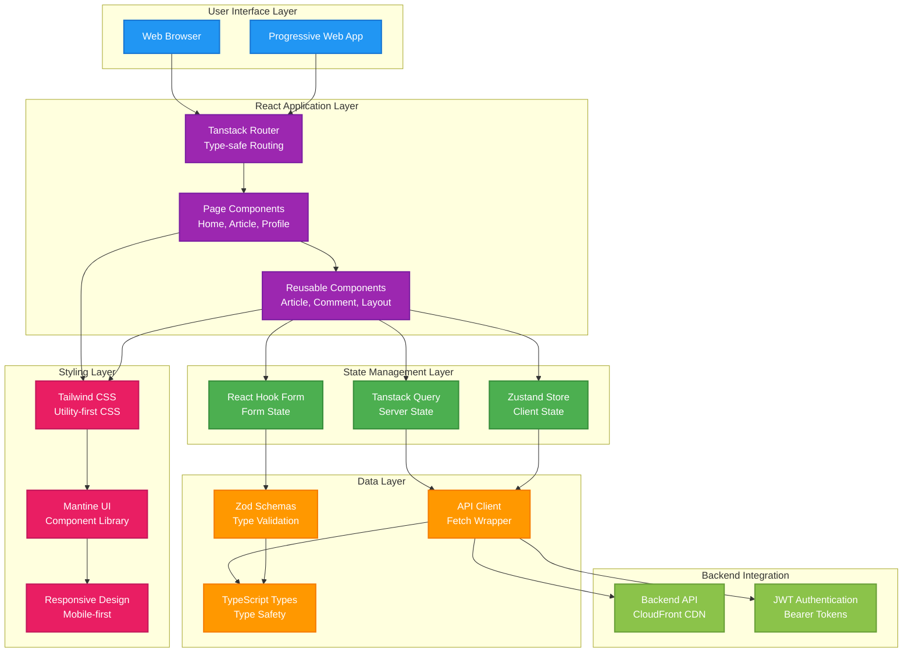
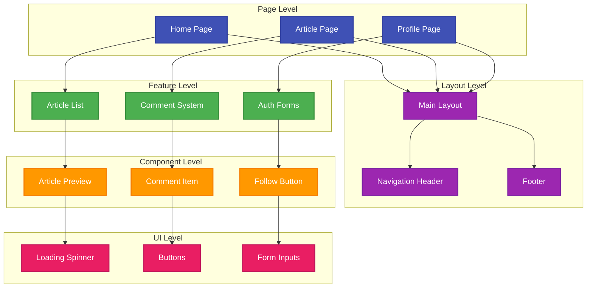

# RealWorld Frontend (React + TypeScript)

[](https://github.com/Hands-On-Vibe-Coding/realworld-vibe-coding/actions/workflows/frontend-deploy.yml)

A modern, responsive frontend implementation of the [RealWorld specification](https://realworld-docs.netlify.app/docs/specs/frontend-specs) built with React 19, TypeScript, and modern tooling, following best practices for maintainability and performance.

## 🎯 Live Demo

**🌐 Production**: [https://hands-on-vibe-coding.github.io/realworld-vibe-coding/](https://hands-on-vibe-coding.github.io/realworld-vibe-coding/)

## 🏗️ Architecture Overview



## 📁 Project Structure

```
frontend/
├── public/
│   ├── vite.svg                 # App icon
│   └── 404.html                 # GitHub Pages 404 handler
├── src/
│   ├── components/              # Reusable React components
│   │   ├── Article/             # Article-related components
│   │   │   ├── ArticleDetail.tsx      # Single article view
│   │   │   ├── ArticleList.tsx        # Article listing
│   │   │   ├── ArticlePreview.tsx     # Article preview card
│   │   │   ├── FeedArticleList.tsx    # User feed
│   │   │   ├── TagsSidebar.tsx        # Tags sidebar
│   │   │   └── index.ts               # Component exports
│   │   ├── Comment/             # Comment system components
│   │   │   ├── CommentForm.tsx        # Comment creation form
│   │   │   ├── CommentItem.tsx        # Individual comment
│   │   │   ├── CommentList.tsx        # Comments listing
│   │   │   └── index.ts               # Component exports
│   │   ├── Common/              # Shared UI components
│   │   │   └── LoadingSpinner.tsx     # Loading indicator
│   │   ├── Layout/              # Layout components
│   │   │   └── Layout.tsx             # Main app layout
│   │   ├── Profile/             # User profile components
│   │   │   ├── FollowButton.tsx       # Follow/unfollow button
│   │   │   ├── ProfileHeader.tsx      # Profile information
│   │   │   └── index.ts               # Component exports
│   │   └── forms/               # Form components
│   ├── hooks/                   # Custom React hooks
│   │   ├── useArticleMutations.ts     # Article CRUD operations
│   │   ├── useArticles.ts             # Article data fetching
│   │   ├── useComments.ts             # Comment data fetching
│   │   ├── useCreateComment.ts        # Comment creation
│   │   ├── useDeleteComment.ts        # Comment deletion
│   │   ├── usePagination.ts           # Pagination logic
│   │   ├── useProfile.ts              # Profile data fetching
│   │   ├── useTags.ts                 # Tags data fetching
│   │   └── index.ts                   # Hook exports
│   ├── lib/                     # Core utilities and configuration
│   │   ├── api.ts                     # API client with authentication
│   │   ├── router.ts                  # Tanstack Router configuration
│   │   ├── schemas.ts                 # Zod validation schemas
│   │   └── utils.test.ts              # Utility function tests
│   ├── pages/                   # Page components (route handlers)
│   │   ├── Article.tsx                # Article detail page
│   │   ├── Editor.tsx                 # Article editor page
│   │   ├── Home.tsx                   # Homepage with article feed
│   │   ├── Login.tsx                  # Login page
│   │   ├── Profile.tsx                # User profile page
│   │   └── Register.tsx               # User registration page
│   ├── stores/                  # Zustand state management
│   │   ├── auth.ts                    # Authentication store
│   │   └── authStore.ts               # Extended auth store
│   ├── test/                    # Test utilities and setup
│   │   ├── fixtures.ts                # Test data fixtures
│   │   ├── setup.ts                   # Test environment setup
│   │   └── test-utils.tsx             # Testing utilities
│   ├── theme/                   # Theme configuration
│   │   └── index.ts                   # Mantine theme setup
│   ├── types/                   # TypeScript type definitions
│   │   └── index.ts                   # Shared type definitions
│   ├── App.tsx                  # Root application component
│   ├── App.css                  # Global application styles
│   ├── main.tsx                 # Application entry point
│   ├── index.css                # Global CSS and Tailwind imports
│   └── vite-env.d.ts            # Vite environment types
├── e2e/                         # End-to-end tests (Playwright)
│   ├── basic.spec.ts                  # Basic functionality tests
│   ├── smoke.spec.ts                  # Smoke tests
│   └── test-helpers.ts                # E2E test utilities
├── scripts/                     # Development and build scripts
├── Dockerfile                   # Production container
├── nginx.conf                   # Nginx configuration for serving
├── package.json                 # Dependencies and scripts
├── tsconfig.json                # TypeScript configuration
├── vite.config.ts               # Vite build configuration
├── vitest.config.ts             # Vitest test configuration
├── playwright.config.ts         # Playwright E2E configuration
├── eslint.config.js             # ESLint linting rules
└── README.md                    # This file
```

## 🚀 Quick Start

### Prerequisites

- Node.js 18+ and npm
- Modern web browser with ES2022 support

### Local Development

1. **Clone and navigate to frontend directory:**
   ```bash
   git clone <repository-url>
   cd realworld-vibe-coding/frontend
   ```

2. **Install dependencies:**
   ```bash
   npm install
   ```

3. **Start development server:**
   ```bash
   npm run dev
   ```

4. **Open browser:**
   Navigate to [http://localhost:5173](http://localhost:5173)

### Using Make Commands (Recommended)

From the project root directory:

```bash
# Start frontend development server
make dev-front

# Run frontend tests
make test-front

# Build frontend for production
make build-front

# Run linting
make lint

# Clean build artifacts
make clean
```

## 🔧 Configuration

### Environment Variables

| Variable | Description | Default |
|----------|-------------|---------|
| `VITE_API_BASE_URL` | Backend API base URL | CloudFront CDN URL |
| `VITE_BASE_URL` | App base path for routing | `/realworld-vibe-coding/` |

### Build Configuration

```typescript
// vite.config.ts
export default defineConfig({
  plugins: [react()],
  server: {
    port: 5173,
    proxy: {
      '/api': 'http://localhost:8080'  // Development proxy
    }
  },
  build: {
    outDir: 'dist',
    sourcemap: true
  }
})
```

## 🧩 Component Architecture



## 🎨 Styling System

### Tailwind CSS Configuration

```javascript
// tailwind.config.js
module.exports = {
  content: ['./index.html', './src/**/*.{js,ts,jsx,tsx}'],
  theme: {
    extend: {
      colors: {
        primary: '#5cb85c',
        danger: '#d9534f',
        // Custom color palette
      }
    }
  },
  plugins: [
    require('@tailwindcss/forms'),
    require('@tailwindcss/typography')
  ]
}
```

### Component Styling Approach

- **Utility-first**: Tailwind CSS for rapid development
- **Component Library**: Mantine for complex UI components
- **Responsive Design**: Mobile-first approach
- **Dark Mode**: Automatic theme detection support

## 🔄 State Management

### Server State (Tanstack Query)

```typescript
// Example: Article fetching hook
const useArticles = (params?: ArticleParams) => {
  return useQuery({
    queryKey: ['articles', params],
    queryFn: () => api.getArticles(params),
    staleTime: 5 * 60 * 1000, // 5 minutes
  })
}
```

### Client State (Zustand)

```typescript
// Authentication store
interface AuthStore {
  user: User | null
  token: string | null
  login: (user: User, token: string) => void
  logout: () => void
  isAuthenticated: boolean
}
```

### Form State (React Hook Form + Zod)

```typescript
// Form validation with Zod schemas
const loginSchema = z.object({
  email: z.string().email('Invalid email'),
  password: z.string().min(8, 'Password too short')
})

type LoginForm = z.infer<typeof loginSchema>
```

## 🧪 Testing Strategy

### Unit Tests (Vitest)

```bash
# Run unit tests
npm run test

# Run tests with coverage
npm run test:coverage

# Run tests in watch mode
npm run test:watch
```

### Integration Tests (React Testing Library)

```typescript
// Example component test
test('renders article preview correctly', () => {
  render(<ArticlePreview article={mockArticle} />)
  expect(screen.getByText(mockArticle.title)).toBeInTheDocument()
})
```

### End-to-End Tests (Playwright)

```bash
# Run E2E tests
npm run test:e2e

# Run E2E tests in UI mode
npm run test:e2e:ui

# Generate E2E test report
npm run test:e2e:report
```

### Test Coverage Goals

- **Unit Tests**: 80%+ coverage for utilities and hooks
- **Integration Tests**: Key user flows and component interactions
- **E2E Tests**: Critical paths and smoke tests

## 📱 Progressive Web App Features

- **Responsive Design**: Mobile-first, works on all devices
- **Fast Loading**: Code splitting and lazy loading
- **Offline Support**: Service worker for basic offline functionality
- **Performance Optimized**: Lighthouse score 90+

## 🔒 Security Features

- **XSS Prevention**: Input sanitization and CSP headers
- **Authentication**: JWT token management with auto-refresh
- **Route Protection**: Private routes with authentication guards
- **Type Safety**: End-to-end TypeScript for runtime safety

## 🚀 Deployment

### GitHub Pages Deployment

The frontend is automatically deployed to GitHub Pages via GitHub Actions:

```yaml
# .github/workflows/frontend-deploy.yml
- name: Build
  run: npm run build
  env:
    VITE_API_BASE_URL: ${{ vars.VITE_API_BASE_URL }}

- name: Deploy to GitHub Pages
  uses: peaceiris/actions-gh-pages@v3
```

### Build Optimization

- **Code Splitting**: Automatic route-based code splitting
- **Tree Shaking**: Removes unused code from bundles
- **Asset Optimization**: Image and font optimization
- **Gzip Compression**: Automatic compression via CDN

## 📊 Performance Monitoring

### Core Web Vitals

- **LCP (Largest Contentful Paint)**: < 2.5s
- **FID (First Input Delay)**: < 100ms
- **CLS (Cumulative Layout Shift)**: < 0.1

### Bundle Analysis

```bash
# Analyze bundle size
npm run build:analyze

# View bundle report
npm run preview
```

## 🔧 Development Guidelines

### Code Style

- **TypeScript**: Strict mode enabled for type safety
- **ESLint**: Automated linting with React-specific rules
- **Prettier**: Consistent code formatting
- **Conventional Commits**: Standardized commit messages

### Component Development

1. **Start with Types**: Define TypeScript interfaces first
2. **Pure Components**: Prefer functional components with hooks
3. **Single Responsibility**: One concern per component
4. **Composition**: Use composition over inheritance
5. **Testing**: Write tests alongside component development

### Performance Best Practices

- **Lazy Loading**: Use React.lazy() for code splitting
- **Memoization**: Use React.memo() for expensive components
- **Virtualization**: Use virtual scrolling for large lists
- **Debouncing**: Debounce search and API calls

## 🔍 Debugging Tools

### Development Tools

- **React DevTools**: Component tree inspection
- **React Query DevTools**: Server state debugging
- **Vite DevTools**: Build and HMR debugging
- **TypeScript Compiler**: Type checking and errors

### Browser DevTools Integration

- **Source Maps**: Full source code debugging in production
- **Network Panel**: API request/response inspection
- **Performance Panel**: Runtime performance analysis
- **Lighthouse**: Automated performance auditing

## 🤝 Contributing

### Getting Started

1. Fork the repository
2. Create a feature branch: `git checkout -b feature/new-feature`
3. Follow the coding standards and write tests
4. Submit a pull request with clear description

### Code Review Checklist

- [ ] TypeScript types are properly defined
- [ ] Components are properly tested
- [ ] Accessibility guidelines followed
- [ ] Performance considerations addressed
- [ ] Documentation updated

## 📄 License

This project is part of the RealWorld implementation showcase and follows educational use guidelines.

---

## 🛠️ Development Tools

This frontend was developed using:
- **Claude Code**: AI-powered development tool for rapid prototyping and implementation
- **Claude Sonnet 4**: Advanced language model for code generation and technical guidance

---

**Tech Stack**: React 19 | TypeScript | Vite | Tanstack Query | Zustand | Tailwind CSS | Mantine | Vitest | Playwright | GitHub Pages
